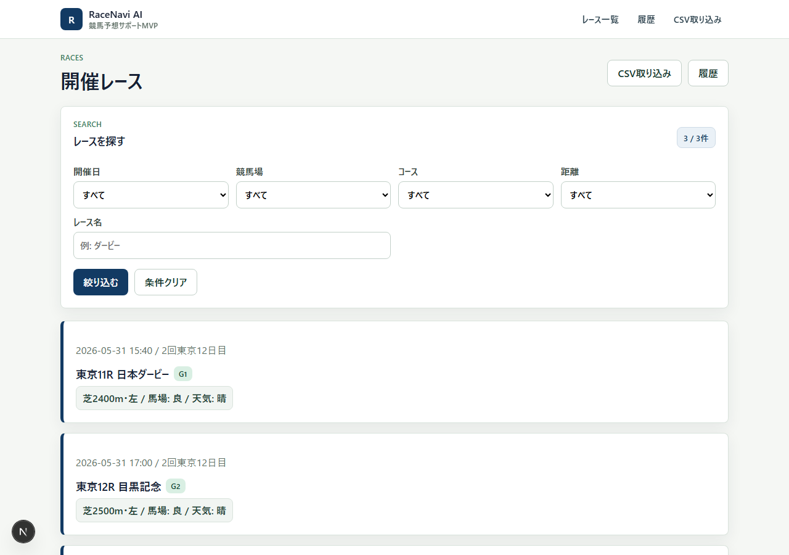
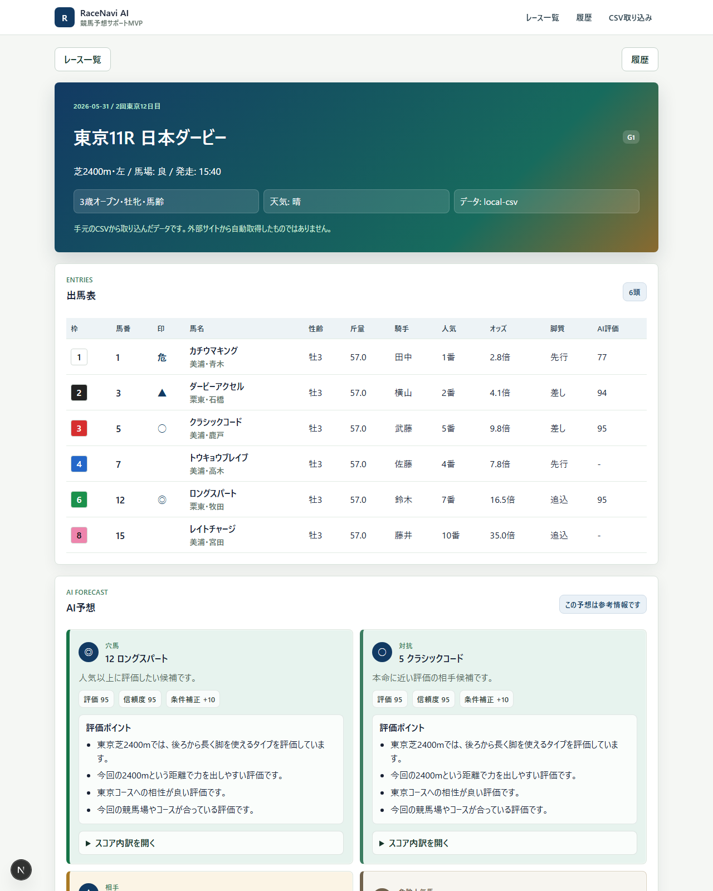
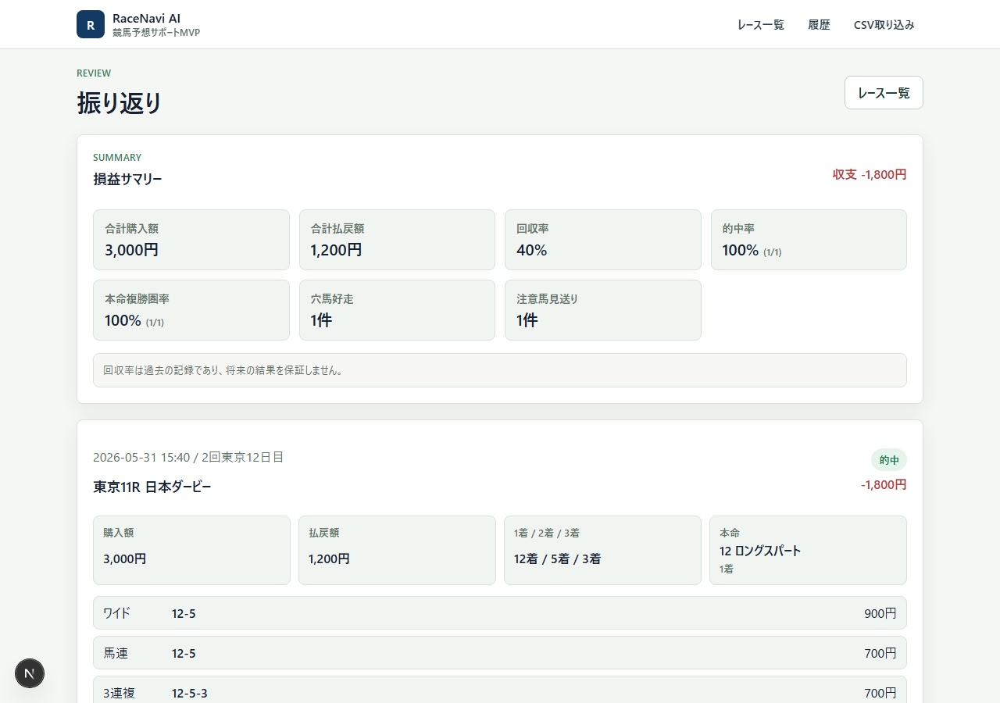
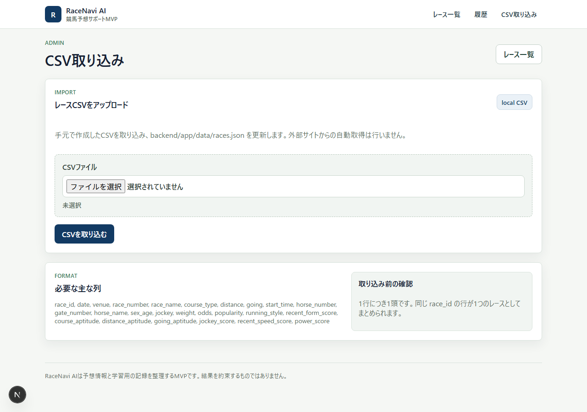

# RaceNavi AI


RaceNavi AI は、競馬初心者が「どの馬をなぜ評価したのか」「予算内でどう買い目を考えるのか」「結果をどう振り返るのか」を確認するためのMVPです。

予想や買い目は参考情報です。的中や利益を保証するものではありません。

## これは何か

- レース条件に応じて、出走馬の評価ポイントを分かりやすく表示します
- 予算、目的、リスクに合わせて買い目プランを作ります
- 保存した買い目に結果を入力し、収支や回収率を過去の記録として振り返れます
- レースデータは手元で合法的に用意したCSVから取り込めます

## 画面でできること

| 画面 | できること |
| --- | --- |
| `/races` | レース一覧、開催日・競馬場・距離・レース名での絞り込み |
| `/races/[raceId]` | 出馬表、AI予想、評価ポイント、スコア内訳、買い目生成 |
| `/history` | 保存済み買い目、損益サマリー、結果入力、AI予想の振り返り |
| `/admin/import` | CSVアップロード、CSV検証、`races.json` への反映 |

## スクリーンショット

### レース一覧



### レース詳細・AI予想



### 履歴・結果入力



### CSV取り込み



## デモ手順

1. `/races` を開き、東京11R 日本ダービーを選びます
2. 出馬表とAI予想カードを見せます
3. `スコア内訳を開く` で、なぜ評価されたかを確認します
4. 買い目生成で `予算: 3000円 / 目的: バランス / リスク: 中` を選びます
5. `買い目を作る` を押し、券種・組み合わせ・金額を確認します
6. `/history` へ移動し、保存された買い目を確認します
7. 結果入力で払戻、的中、1〜3着、本命着順、メモを入れます
8. 損益サマリーとAI予想の振り返りを見せます

詳しいデモ台本は [docs/DEMO_SCENARIO.md](docs/DEMO_SCENARIO.md) にあります。

## MVPでできること

- レース一覧の表示
- 開催日、競馬場、芝/ダート、距離、レース名での絞り込み
- レース詳細と出馬表の表示
- AI風の予想印、評価ポイント、スコア内訳の表示
- 予算、目的、リスクに応じた買い目プラン作成
- 買い目プランの履歴保存
- 払戻、的中、本命着順、1〜3着、メモの入力
- 損益サマリー、回収率、的中率、本命複勝圏率の確認
- CSVから `races.json` へレースデータを取り込み

## できないこと・やらないこと

- 実際の馬券購入
- 自動投票、購入代行、決済機能
- 的中や利益の保証
- リアルタイムオッズ取得
- JRA-VANなど外部有料データ連携
- netkeibaなど外部サイトからの直接スクレイピング
- 法的権利が不明なデータの自動収集

## プロジェクト概要

- Backend: FastAPI + SQLite + JSON/CSVデータ
- Frontend: Next.js App Router
- Race data: `backend/app/data/races.json`
- CSV sample: `backend/app/data/sample_race.csv`
- Main app URL: `http://localhost:3000`
- Backend API: `http://localhost:8000`

## 推奨作業場所

OneDrive配下ではなく、以下のようなローカル開発用フォルダで作業してください。

```text
C:\dev\keibaapp
```

`node_modules`、`.next-build`、`.venv` などは小さなファイルが大量に作られるため、OneDrive同期対象に置くと容量・同期・ロックの問題が起きやすくなります。

## 初回セットアップ

Backend:

```powershell
cd C:\dev\keibaapp\backend
python -m venv .venv
.\.venv\Scripts\python.exe -m pip install -r requirements.txt
```

Frontend:

```powershell
cd C:\dev\keibaapp\frontend
npm install --cache .\.npm-cache
```

## バックエンド起動方法

```powershell
cd C:\dev\keibaapp\backend
.\.venv\Scripts\activate
python -m uvicorn app.main:app --reload
```

確認URL:

```text
http://localhost:8000/health
```

`{"status":"ok"}` が返れば起動しています。

## フロントエンド起動方法

```powershell
cd C:\dev\keibaapp\frontend
npm run dev
```

表示URL:

```text
http://localhost:3000
```

## CSV取り込み方法

CSVは1行につき1頭です。同じ `race_id` の行が1つのレースとしてまとめられます。手元で合法的に用意したCSVだけを使ってください。

必須列:

```text
race_id,date,venue,race_number,race_name,course_type,distance,going,start_time,horse_number,gate_number,horse_name,sex_age,jockey,weight,odds,popularity,running_style,recent_form_score,course_aptitude,distance_aptitude,going_aptitude,jockey_score,recent_speed_score,power_score
```

### PowerShellから取り込む

```powershell
cd C:\dev\keibaapp\backend
.\.venv\Scripts\python.exe tools\import_race_csv.py app\data\sample_race.csv
```

成功すると `backend/app/data/races.json` が更新されます。不正なCSVの場合は、たとえば `row 2, field 'odds'` のように修正箇所が表示されます。

### ブラウザから取り込む

1. Backend と Frontend を起動します
2. `http://localhost:3000/admin/import` を開きます
3. CSVファイルを選択します
4. `CSVを取り込む` を押します
5. 成功時は取り込んだレース数・出走馬数が表示されます

## レース確認URL

```text
http://localhost:3000/races
http://localhost:3000/races/tokyo-2026-05-31-11
http://localhost:3000/history
http://localhost:3000/admin/import
```

## 買い目生成・履歴・結果入力の使い方

1. `/races` で見たいレースを探します
2. レース詳細でAI予想、評価ポイント、スコア内訳を確認します
3. 買い目生成フォームで予算、目的、リスク、3連単の有無を選びます
4. `買い目を作る` を押すと、買い目プランが作成され履歴に保存されます
5. `/history` で保存済みプランを確認します
6. レース後に的中、払戻、1〜3着、本命の着順、メモを入力します
7. 損益サマリーとAI予想の振り返りを確認します

## 動作確認

Backend tests:

```powershell
cd C:\dev\keibaapp\backend
.\.venv\Scripts\python.exe -m pytest
```

Frontend build:

```powershell
cd C:\dev\keibaapp\frontend
npm run build
```

GitHub Actionsでも `pytest` と `npm run build` を自動実行します。

## 法律・免責・データ利用の注意

- RaceNavi AI は予想情報、買い目シミュレーション、振り返りを支援するMVPです
- 的中、払戻、利益、回収率を保証しません
- 馬券購入は利用者自身の判断と責任で行ってください
- 外部サイトの利用規約、著作権、データベース権、スクレイピング禁止事項に注意してください
- このMVPでは外部サイトからの直接スクレイピングは実装しません
- CSVに入れるデータは、手元で合法的に利用できるものだけにしてください

## トラブルシューティング

### `localhost:3000` が開けない

Frontendが起動しているか確認してください。

```powershell
cd C:\dev\keibaapp\frontend
npm run dev
```

### `API error` が出る

Backendが起動しているか確認してください。

```powershell
cd C:\dev\keibaapp\backend
.\.venv\Scripts\activate
python -m uvicorn app.main:app --reload
```

### CSV取り込みで失敗する

エラーに表示された行番号と列名を確認します。

例:

```text
row 2, field 'odds': expected number, got 'abc'
```

この場合、CSVの2行目の `odds` を数値に直してください。

### OneDrive同期が重い

プロジェクトを `C:\dev\keibaapp` などOneDrive外へ置いてください。`node_modules`、`.venv`、`.next-build` はGitにも同期にも含めない運用を推奨します。

## GitHubへ上げる前の確認手順

1. 作業場所が `C:\dev\keibaapp` であることを確認します
2. `.gitignore` に生成物が含まれていることを確認します
3. 不要なログ、DB、一時ファイルをGit管理に含めないことを確認します
4. Backend tests を通します
5. Frontend build を通します
6. READMEの起動方法とCSV取り込み方法が最新であることを確認します

確認コマンド:

```powershell
cd C:\dev\keibaapp\backend
.\.venv\Scripts\python.exe -m pytest

cd C:\dev\keibaapp\frontend
npm run build
```

Git管理に含めない主なもの:

```text
.venv/
node_modules/
.next/
.next-build/
.npm-cache/
__pycache__/
.pytest_cache/
*.db
.env
server.log
server.err.log
```
